# Nova Store — Entity-Relationship Diagram

All schemas run on a single MySQL 8.4 server. Each schema is owned by one
service and can be migrated to a dedicated database server independently.

## ER Diagram (Mermaid)

```mermaid
erDiagram
    users {
        bigint id PK
        varchar email UK
        varchar password_hash
        varchar first_name
        varchar last_name
        varchar phone
        enum role "CUSTOMER|MANAGER|ADMIN"
        varchar avatar_url
        datetime email_verified_at
        tinyint is_active
        datetime last_login_at
        datetime created_at
        datetime updated_at
        datetime deleted_at
    }

    user_profiles {
        bigint id PK
        bigint user_id FK "users.id"
        varchar bio
        tinyint newsletter_opt_in
        varchar preferred_language
        char currency
    }

    user_addresses {
        bigint id PK
        bigint user_id FK "users.id"
        varchar label
        varchar full_name
        varchar phone
        varchar address_line1
        varchar address_line2
        varchar city
        varchar state
        varchar postal_code
        varchar country
        tinyint is_default
    }

    refresh_tokens {
        bigint id PK
        bigint user_id FK "users.id"
        char token_hash UK
        datetime expires_at
        datetime revoked_at
        char replaced_by
        varchar ip_address
        varchar user_agent
    }

    password_reset_tokens {
        bigint id PK
        bigint user_id FK "users.id"
        char token_hash UK
        datetime expires_at
        datetime used_at
    }

    email_verification_tokens {
        bigint id PK
        bigint user_id FK "users.id"
        char token_hash UK
        datetime expires_at
        datetime used_at
    }

    categories {
        bigint id PK
        varchar slug UK
        varchar name
        varchar description
        bigint parent_id FK "categories.id"
        varchar image_url
        varchar icon
        int sort_order
        tinyint is_active
    }

    products {
        bigint id PK
        varchar slug UK
        varchar name
        varchar tagline
        text description
        varchar brand
        bigint category_id FK "categories.id"
        decimal base_price
        decimal compare_at_price
        varchar badge
        tinyint is_featured
        tinyint is_new
        enum status "draft|active|archived"
    }

    product_variants {
        bigint id PK
        bigint product_id FK "products.id"
        varchar sku UK
        varchar name
        varchar color
        char color_swatch
        varchar storage
        decimal price
        decimal compare_at_price
        tinyint is_default
        tinyint is_active
    }

    product_images {
        bigint id PK
        bigint product_id FK "products.id"
        bigint variant_id FK "product_variants.id"
        varchar url
        varchar alt_text
        int sort_order
        tinyint is_primary
    }

    product_specifications {
        bigint id PK
        bigint product_id FK "products.id"
        varchar name
        varchar value
        int sort_order
    }

    promotions {
        bigint id PK
        varchar name
        varchar slug UK
        varchar description
        enum discount_type "percent|fixed"
        decimal discount_value
        datetime starts_at
        datetime ends_at
        tinyint is_active
    }

    product_promotions {
        bigint id PK
        bigint product_id FK "products.id"
        bigint promotion_id FK "promotions.id"
    }

    coupons {
        bigint id PK
        varchar code UK
        varchar name
        enum discount_type "percent|fixed"
        decimal discount_value
        int max_uses
        int used_count
        decimal min_order_amount
        datetime expires_at
        tinyint is_active
    }

    inventory {
        bigint id PK
        bigint variant_id UK
        int quantity
        int reserved_quantity
        int low_stock_threshold
    }

    inventory_movements {
        bigint id PK
        bigint variant_id
        enum change_type "adjust|restock|reserve|release|deduct"
        int quantity_change
        varchar reference_type
        varchar reference_id
    }

    stock_reservations {
        bigint id PK
        char reservation_token UK
        bigint order_id
        bigint variant_id
        int quantity
        enum status "ACTIVE|RELEASED|CONFIRMED|EXPIRED"
        datetime expires_at
    }

    carts {
        bigint id PK
        bigint user_id
        varchar session_key UK
        enum status "active|converted|abandoned"
    }

    cart_items {
        bigint id PK
        bigint cart_id FK "carts.id"
        bigint variant_id
        int quantity
        decimal unit_price
    }

    orders {
        bigint id PK
        varchar order_number UK
        bigint user_id
        varchar customer_email
        varchar customer_name
        enum status "PENDING|CONFIRMED|PROCESSING|SHIPPED|DELIVERED|CANCELLED|REFUNDED"
        decimal items_subtotal
        decimal discount_total
        decimal shipping_total
        decimal grand_total
        char currency
        varchar coupon_code
        json shipping_address
        json billing_address
        enum payment_status "UNPAID|PAID|REFUNDED|PARTIALLY_REFUNDED"
    }

    order_items {
        bigint id PK
        bigint order_id FK "orders.id"
        bigint variant_id
        varchar product_name
        varchar variant_name
        varchar sku
        decimal unit_price
        int quantity
        decimal line_total
    }

    order_status_events {
        bigint id PK
        bigint order_id FK "orders.id"
        varchar from_status
        varchar to_status
        varchar note
        enum actor_type "SYSTEM|CUSTOMER|STAFF"
    }

    payments {
        bigint id PK
        varchar payment_id UK
        bigint order_id
        bigint user_id
        decimal amount
        char currency
        enum status "PENDING|AUTHORIZED|CONFIRMED|FAILED|CANCELLED|REFUNDED"
        enum method "card|upi|netbanking|wallet|mock"
        varchar provider
    }

    refunds {
        bigint id PK
        varchar refund_id UK
        bigint payment_id FK "payments.id"
        decimal amount
        varchar reason
        enum status "PENDING|COMPLETED|FAILED"
    }

    delivery_methods {
        bigint id PK
        varchar code UK
        varchar name
        varchar description
        decimal fee
        int estimated_days_min
        int estimated_days_max
    }

    shipments {
        bigint id PK
        varchar shipment_number UK
        bigint order_id
        varchar carrier
        varchar tracking_number
        varchar method_code
        varchar recipient_name
        json address
        enum status "PENDING|PICKED_UP|IN_TRANSIT|OUT_FOR_DELIVERY|DELIVERED|EXCEPTION"
    }

    shipment_events {
        bigint id PK
        bigint shipment_id FK "shipments.id"
        varchar status
        varchar location
        varchar note
    }

    reviews {
        bigint id PK
        bigint product_id
        bigint user_id
        bigint order_id
        tinyint rating
        varchar title
        text body
        tinyint is_verified_purchase
        enum status "PENDING|APPROVED|REJECTED"
        int helpful_count
    }

    review_helpful {
        bigint id PK
        bigint review_id FK "reviews.id"
        bigint user_id
    }

    notification_templates {
        bigint id PK
        varchar type UK
        enum channel "email|in_app|sms"
        varchar subject_template
        text body_template
    }

    notifications {
        bigint id PK
        bigint user_id
        varchar email
        enum channel "email|in_app|sms"
        varchar type
        varchar subject
        text body
        json payload
        datetime read_at
    }

    email_logs {
        bigint id PK
        varchar to_email
        varchar from_email
        varchar subject
        mediumtext html_body
        varchar provider
        enum status "QUEUED|SENT|FAILED"
    }

    users ||--o{ user_profiles : "has"
    users ||--o{ user_addresses : "has"
    users ||--o{ refresh_tokens : "has"
    users ||--o{ password_reset_tokens : "has"
    users ||--o{ email_verification_tokens : "has"

    categories ||--o{ categories : "parent"
    categories ||--o{ products : "contains"
    products ||--o{ product_variants : "has"
    products ||--o{ product_images : "has"
    products ||--o{ product_specifications : "has"
    products ||--o{ product_promotions : "in"
    promotions ||--o{ product_promotions : "applied to"

    carts ||--o{ cart_items : "contains"

    orders ||--o{ order_items : "contains"
    orders ||--o{ order_status_events : "history"
    orders ||--o| payments : "paid via"
    orders ||--o| shipments : "shipped as"

    payments ||--o{ refunds : "refunded"

    shipments ||--o{ shipment_events : "timeline"
    reviews ||--o{ review_helpful : "votes"
```

## Per-Schema Table Reference

### `nova_user` — Auth + User Service

| Table                       | Key Columns                                                        |
|-----------------------------|--------------------------------------------------------------------|
| `users`                     | id (PK), email (UK), password_hash, first_name, last_name, role, is_active, deleted_at |
| `user_profiles`             | id (PK), user_id (FK→users, UK), bio, newsletter_opt_in, currency  |
| `user_addresses`            | id (PK), user_id (FK→users), label, full_name, city, is_default    |
| `refresh_tokens`            | id (PK), user_id (FK→users), token_hash (UK), expires_at           |
| `password_reset_tokens`     | id (PK), user_id (FK→users), token_hash (UK), expires_at           |
| `email_verification_tokens` | id (PK), user_id (FK→users), token_hash (UK), expires_at           |

### `nova_product` — Product Service

| Table                  | Key Columns                                                          |
|------------------------|----------------------------------------------------------------------|
| `categories`           | id (PK), slug (UK), name, parent_id (FK→categories, self-ref)        |
| `products`             | id (PK), slug (UK), name, brand, category_id (FK), base_price, status, is_featured |
| `product_variants`     | id (PK), product_id (FK→products), sku (UK), price, is_default       |
| `product_images`       | id (PK), product_id (FK), variant_id (FK→product_variants), url      |
| `product_specifications`| id (PK), product_id (FK), name, value                               |
| `promotions`           | id (PK), slug (UK), discount_type, discount_value, starts_at, ends_at |
| `product_promotions`   | id (PK), product_id (FK), promotion_id (FK), UK(product_id,promotion_id) |
| `coupons`              | id (PK), code (UK), discount_type, discount_value, max_uses          |

### `nova_inventory` — Inventory Service

| Table                    | Key Columns                                                      |
|--------------------------|------------------------------------------------------------------|
| `inventory`              | id (PK), variant_id (UK), quantity, reserved_quantity, low_stock_threshold |
| `inventory_movements`    | id (PK), variant_id, change_type, quantity_change, reference_type |
| `stock_reservations`     | id (PK), reservation_token (UK), order_id, variant_id, status, expires_at |

### `nova_cart` — Cart Service

| Table        | Key Columns                                                   |
|--------------|---------------------------------------------------------------|
| `carts`      | id (PK), user_id, session_key (UK), status                    |
| `cart_items` | id (PK), cart_id (FK→carts), variant_id, quantity, UK(cart_id,variant_id) |

### `nova_order` — Order Service

| Table                 | Key Columns                                                          |
|-----------------------|----------------------------------------------------------------------|
| `orders`              | id (PK), order_number (UK), user_id, customer_email, status, grand_total, payment_status |
| `order_items`         | id (PK), order_id (FK→orders), variant_id, product_name, unit_price, quantity, line_total |
| `order_status_events` | id (PK), order_id (FK), from_status, to_status, note, actor_type     |

### `nova_payment` — Payment Service

| Table     | Key Columns                                                          |
|-----------|----------------------------------------------------------------------|
| `payments`| id (PK), payment_id (UK), order_id, amount, status, method, provider |
| `refunds` | id (PK), refund_id (UK), payment_id (FK→payments), amount, status    |

### `nova_shipping` — Shipping Service

| Table               | Key Columns                                                          |
|---------------------|----------------------------------------------------------------------|
| `delivery_methods`  | id (PK), code (UK), name, fee, estimated_days_min/max               |
| `shipments`         | id (PK), shipment_number (UK), order_id, tracking_number, status     |
| `shipment_events`   | id (PK), shipment_id (FK→shipments), status, location, note          |

### `nova_review` — Review Service

| Table            | Key Columns                                                          |
|------------------|----------------------------------------------------------------------|
| `reviews`        | id (PK), product_id, user_id, order_id, rating, status, helpful_count |
| `review_helpful` | id (PK), review_id (FK→reviews), user_id, UK(review_id, user_id)    |

### `nova_notification` — Notification Service

| Table                   | Key Columns                                                     |
|-------------------------|-----------------------------------------------------------------|
| `notification_templates`| id (PK), type (UK), channel, subject_template, body_template    |
| `notifications`         | id (PK), user_id, email, type, subject, body, read_at           |
| `email_logs`            | id (PK), to_email, subject, provider, status                    |

## Indexes Summary

Notable indexes beyond primary/unique keys:

- `idx_products_category` — fast category filtering
- `idx_products_status` — filtering active/draft products
- `idx_products_featured` — compound (is_featured, feature_rank) for homepage
- `ft_products_search` — FULLTEXT on name, tagline, description, brand
- `ft_variants_name` — FULLTEXT on variant name for search
- `idx_inventory_low_stock` — low stock alert queries
- `idx_orders_user`, `idx_orders_status`, `idx_orders_email` — order lookups
- `idx_reviews_product_status` — approved reviews per product
- `idx_notifications_unread` — unread notification counts
